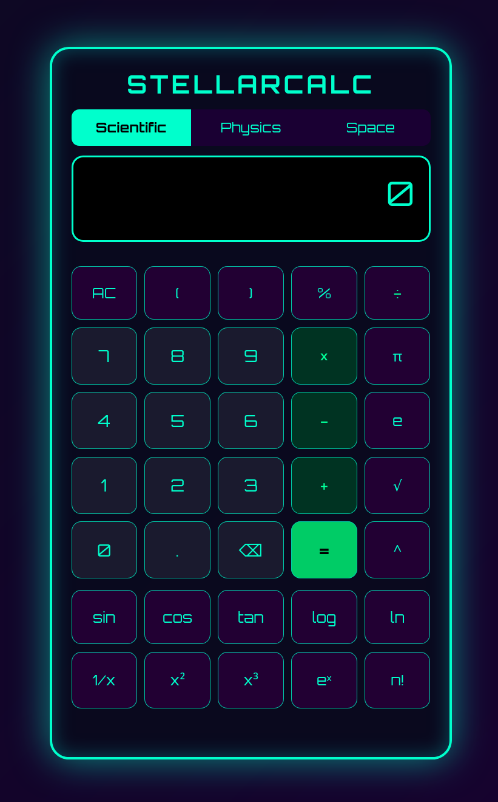

# 🌌 StellarCalc

**A powerful single-file Scientific Calculator with Physics & Space modules** built using HTML, CSS, and JavaScript.

Designed for students, engineers, astronomers, and space enthusiasts. Clean, futuristic UI with Orbitron font and neon cyber theme.



---

**[Try Live Demo](https://pdragonlabs.github.io/sci_calc/)

## ✨ Features

### 🔬 **Scientific Mode**
- Full scientific calculations
- Trigonometric functions (sin, cos, tan) in degrees
- Logarithms (log₁₀ & ln)
- Exponents, square, cube, square root
- Factorials
- Constants: π and e
- Parentheses and keyboard support

### ⚡ **Physics Mode**
- Kinetic Energy (½mv²)
- Gravitational Potential Energy (mgh)
- Force = ma
- Escape Velocity
- Orbital Velocity (circular)
- Gravitational Force

### 🌠 **Space & Astronomy Mode**
- Light Year → km conversion
- Astronomical Unit (AU) value
- Parsec conversion
- Schwarzschild Radius (Black Hole Event Horizon)
- Hubble's Law (recession velocity)
- Speed of light constant

### 🎨 **UI/UX**
- Beautiful dark space theme with neon accents
- Mode tabs (Scientific | Physics | Space)
- Calculation history
- Responsive & mobile-friendly
- Keyboard shortcuts support

---

## 🚀 How to Use

1. Download the project:
   ```bash
   git clone https://github.com/pdragonlabs/stellarcalc.git
